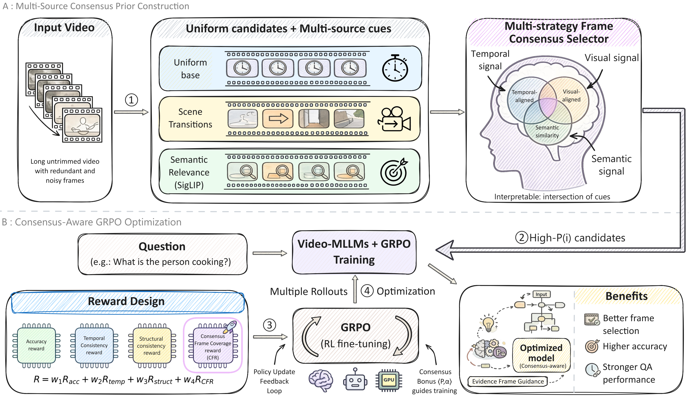

# Reasoning as Intersection: VideoCFR for Visual Focus Alignment in Video-MLLMs

<!-- 替换为你的 Arxiv 链接，如果没有先写 Coming Soon -->

<!-- 替换为 HuggingFace 链接 -->

  

Enhancing Trustworthy Reasoning in Video Multimodal LLMs via Process Supervision

### 📢 News 
---
[2026-02-10] 🚀 This repository is created. We are currently organizing the code and will release it very soon! Please Star ⭐ this repo to stay tuned.  

[2026-02-10] The paper is currently under review.  

### 💡 Abstract  
---
Recent advancements in reinforcement learning have enhanced reasoning in large language models, yet applying this to video multimodal large language models (Video-MLLMs) is challenged by the multi-dimensional redundancy of raw video streams, causing focus dispersion and overreliance on textual biases, where models often guess answers without focusing on key visual cues. Drawing inspiration from the human brain’s prioritization of consensus signals in multisensory processing to amplify aligned cues and filter noise under cognitive constraints, we introduce the Consensus Frame GRPO (CF-GRPO) algorithm, which leverages intrinsic video features like visual, temporal, and semantic cues as natural unlabeled supervision to autonomously sharpen visual focus without expensive annotations. At its core, the Consensus Frame Reward (CFR) mechanism fuses multi-source priors via salience-aware sparse aggregation and distribution sharpening, shifting the learning objective from mere answer accuracy to correct visual focusing. Extensive experiments demonstrate that VideoCFR significantly reduces focus dispersion, achieves state-of-the-art performance on complex video reasoning benchmarks, and enhances model interpretability through consensus frame prior distributions.

 
<em>Figure 1: Visualization of our Consensus Frame Reward (CFR) mechanism.</em>

### 🗓️ Roadmap
---
We are working hard to prepare the codebase for open-source release. The planned release schedule is as follows:

📄 ArXiv Paper Release

🧩 Inference Code: Evaluation scripts.

🏋️ Training Code: Full GRPO training implementation with DeepSpeed ZeRO-3 support.

### 🔍 Methodology Highlights
---
Our method introduces Consensus Frame Reward (CFR) to guide the RL training process:
Hierarchical Prior: Fusing Uniform, Scene, and Semantic signals to construct a robust "Ground Truth" attention distribution without human annotation.  

Sparse Aggregation: Using Max Pooling to capture fine-grained visual cues that are often diluted by Mean Pooling.  

Signal Sharpening: Applying a low temperature (τ=0.1) to generate high-SNR gradients for policy optimization.  

Soft-Gated Integration: Conditioning the visual reward on reasoning correctness to prevent reward hacking.

### 🛠️ Usage (Coming Soon)
---
We will provide detailed instructions on how to set up the environment and run the code.

### 📧 Contact
---
If you have any questions, please feel free to open an issue or contact.
