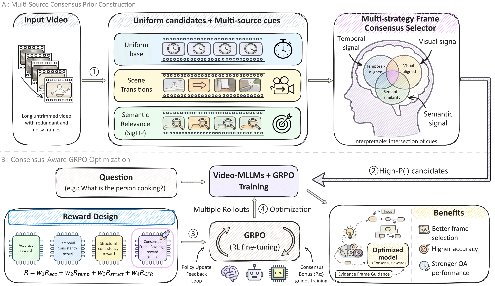

# Reasoning as Intersection: VideoCFR for Visual Focus Alignment in Video-MLLMs

<div align="center">


<br>


<br>

[](LICENSE)
[](requirements.txt)
[](#release-status)

**VideoCFR** studies process-level reward design for evidence-aware video reasoning.

</div>

VideoCFR introduces **Consensus Frame GRPO (CF-GRPO)**, an annotation-free reinforcement-learning framework for Video-MLLMs. Instead of relying only on final-answer correctness, CF-GRPO adds a frame-level reward that encourages the generated response to align with candidate visual evidence frames. The consensus prior is built from intrinsic video cues: temporal coverage, scene transitions, and query-conditioned visual relevance.

This repository contains the training and evaluation code used for VideoCFR. Large model checkpoints, benchmark media, and training datasets are not stored in the git repository; see [docs/DATA_AND_MODELS.md](docs/DATA_AND_MODELS.md) for the expected local layout and source notes.

## Release Status

- Training code: available under [CFR/r1-v](CFR/r1-v).
- CFR reward implementation: available in [CFR/r1-v/src/open_r1/trainer/grpo_trainer.py](CFR/r1-v/src/open_r1/trainer/grpo_trainer.py).
- Inference example: available in [CFR/inference_example.py](CFR/inference_example.py).
- Evaluation script: available in [CFR/eval_bench.py](CFR/eval_bench.py).
- Model checkpoints and full datasets: not included in this repository.
- Paper and checkpoint links: will be updated after public release.

## Method Overview

CF-GRPO augments GRPO-style post-training with the **Consensus Frame Reward (CFR)**. CFR compares two frame-level distributions:

- a **consensus prior** derived from uniform temporal sampling, scene-change cues, and semantic relevance to the query;
- a **model-side frame-use score** derived from the association between visual frame representations and response hidden states.

The reward favors agreement between these distributions while keeping standard answer, format, length, and temporal-consistency rewards. This is different from inference-time key-frame filtering: CFR changes the training objective and provides evidence-level feedback during policy optimization.

<div align="center">

<br>
<em>Overview of consensus-prior construction and consensus-aware GRPO optimization.</em>
</div>

## Main Results

The table below summarizes the reported VideoCFR results from the current manuscript draft. Results are accuracy (%). Comparisons should be interpreted under the evaluation settings and frame budgets reported by the corresponding methods.

| Benchmark | 16 frames | 32 frames | 64 frames |
| --- | ---: | ---: | ---: |
| VSI-Bench | 31.8 | 33.1 | 34.8 |
| VideoMMMU | 50.5 | 52.4 | 50.6 |
| MMVU(mc) | 66.4 | 65.9 | 66.7 |
| MVBench | 66.1 | 64.5 | 63.9 |
| TempCompass | 70.8 | 72.8 | 72.9 |
| VideoMME(wo sub) | 55.1 | 58.9 | 61.1 |

Increasing the frame budget improves several benchmarks, while the effect remains benchmark-dependent. Ablations in the paper indicate that the consensus prior, sparse aggregation, and distribution sharpening each contribute to the final performance.

## Repository Layout

```text
.
+-- CFR/
|   +-- inference_example.py          # Single-video vLLM inference example
|   +-- eval_bench.py                 # Benchmark evaluation runner
|   +-- generate_cot_vllm.py          # CoT data generation helper
|   +-- scripts/
|   |   +-- run_sft_video.sh          # SFT launch script
|   |   +-- run_grpo_video.sh         # GRPO launch script
|   |   +-- run_grpo_vllm_qwen25vl.sh # GRPO + vLLM launch script
|   +-- r1-v/                         # Video RL training code adapted for VideoCFR
|   +-- qwen-vl-utils/                # Local Qwen-VL utility package
+-- Pictures/
|   +-- main.png                      # Method overview figure
|   +-- logo_focus_frame.png          # README logo candidate
|   +-- videocfr_wordmark.svg         # Editable README wordmark
+-- docs/
|   +-- DATA_AND_MODELS.md            # Large-file and dataset source notes
+-- requirements.txt
+-- setup.sh
```

## Environment

The training and evaluation code targets Linux machines with CUDA GPUs. The main experiments use 8 NVIDIA A800 GPUs. macOS can be used for reading and light code inspection, but CUDA-only packages such as `flash-attn`, `deepspeed`, and `vllm` are not expected to run there.

Recommended base environment:

```bash
conda create -n videocfr python=3.10 -y
conda activate videocfr
bash setup.sh
```

If `flash-attn` is already installed or cannot be built on your machine, skip it with:

```bash
INSTALL_FLASH_ATTN=0 bash setup.sh
```

## Inference

Run a single-video example with a local checkpoint or a compatible Hugging Face model:

```bash
python CFR/inference_example.py \
  --model_path /path/to/VideoCFR-or-compatible-Qwen2.5-VL-checkpoint \
  --video_path CFR/example_video/video1.mp4 \
  --question "Which moving object in the video loses system energy?" \
  --problem_type free-form \
  --nframes 32
```

The script uses vLLM and expects the model to support Qwen2.5-VL-style video inputs.

## Training

The training scripts expect data under `CFR/r1-v/Video-R1-data/`. See [docs/DATA_AND_MODELS.md](docs/DATA_AND_MODELS.md) before launching training.

Supervised fine-tuning:

```bash
BASE_MODEL=Qwen/Qwen2.5-VL-7B-Instruct \
SFT_DATASET=./Video-R1-data/Video-R1-COT-165k.json \
bash CFR/scripts/run_sft_video.sh
```

Consensus-aware GRPO:

```bash
SFT_MODEL_PATH=/path/to/sft/checkpoint \
GRPO_DATASET=./Video-R1-data/Video-R1-260k.json \
bash CFR/scripts/run_grpo_video.sh
```

GRPO with a dedicated vLLM worker:

```bash
SFT_MODEL_PATH=/path/to/sft/checkpoint \
GRPO_DATASET=./Video-R1-data/Video-R1-260k.json \
bash CFR/scripts/run_grpo_vllm_qwen25vl.sh
```

Adjust `CUDA_VISIBLE_DEVICES`, `--nproc_per_node`, batch size, and DeepSpeed config for your hardware.

## Evaluation

After preparing benchmark prompt files and media under `CFR/r1-v/Evaluation/` and `CFR/r1-v/Video-R1-data/`, run:

```bash
bash CFR/eval_bench.sh /path/to/model VideoCFR
```

Outputs are written to `CFR/r1-v/eval_results/`.

## Data and Model Files

This repository intentionally excludes large files:

- model checkpoints and optimizer states;
- raw training videos and images;
- benchmark media files;
- generated rollouts, logs, and evaluation outputs.

Please follow the original licenses and terms for all datasets and base models. The expected local data layout is documented in [docs/DATA_AND_MODELS.md](docs/DATA_AND_MODELS.md).

## Citation

If this repository is useful for your work, please cite the project using [CITATION.cff](CITATION.cff). A BibTeX entry will be added after the paper metadata is finalized.

## Acknowledgements

This codebase builds on open-source Video-MLLM and RL training components, including R1-V-style GRPO training code and Qwen-VL utilities. See [THIRD_PARTY.md](THIRD_PARTY.md) for source and license notes.

## Contact

Please open a GitHub issue for reproducibility questions, missing-file reports, or release requests.
